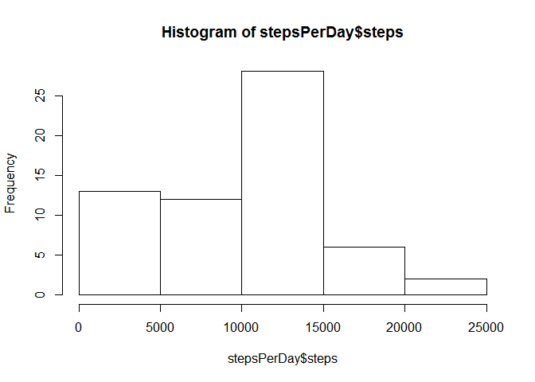
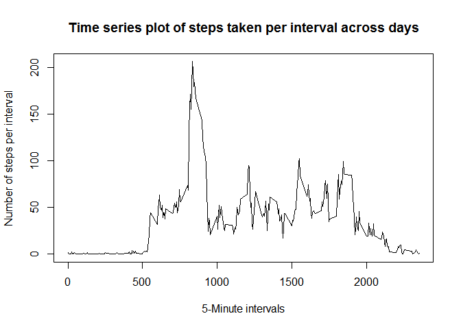
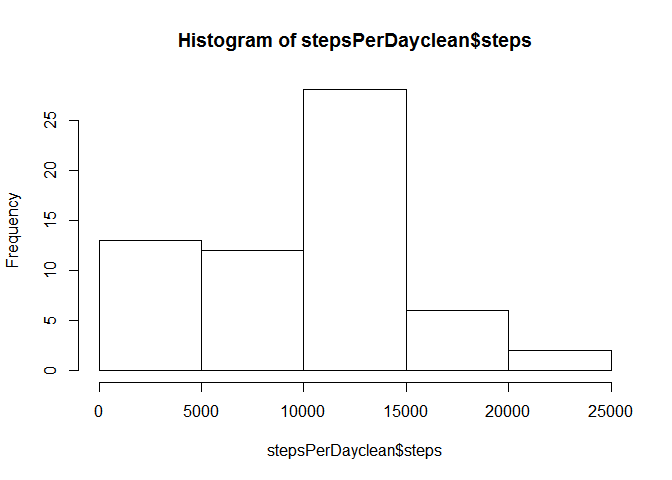
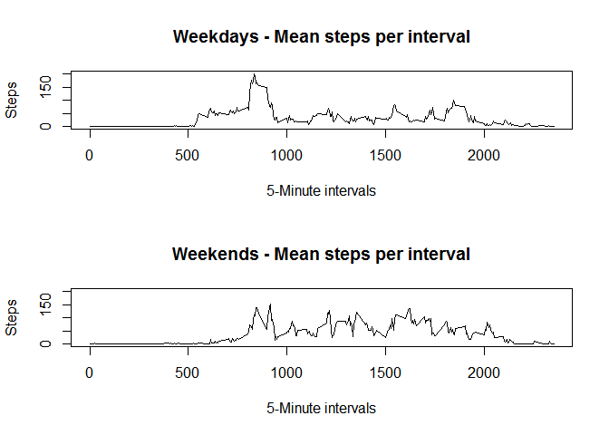

## 1. Code for reading in the dataset and/or processing the data

Read data and convert dates from chr to date type

```r
data <- read.csv("activity.csv", stringsAsFactors = FALSE)
library(lubridate)
```

```
## 
## Attaching package: 'lubridate'
```

```
## The following object is masked from 'package:base':
## 
##     date
```

```r
data$date <- ymd(data$date)
```

## 2. Histogram of the total number of steps taken each day

### Calculate number of steps per day

Apply sum on each daily split of steps counts:

```r
stepsPerDay <- lapply(
    split(data$steps, factor(as.character(data$date))),
    sum,
    na.rm = TRUE)
```

Flatten the list:

```r
stepsPerDay <- data.frame(
    date = names(stepsPerDay),
    steps = unlist(stepsPerDay),
    stringsAsFactors = FALSE
)
```

### Plot

Plot column chart:

```r
hist(stepsPerDay$steps)
```

<!-- -->


## 3. Mean and median number of steps taken each day

```r
mean(stepsPerDay$steps, na.rm = TRUE)
```

```
## [1] 9354.23
```

```r
median(stepsPerDay$steps, na.rm = TRUE)
```

```
## [1] 10395
```

## 4. Time series plot of the average number of steps taken

Average of steps within same interval across each day

```r
stepsPerInterval <- lapply(
    split(data$steps, factor(as.character(data$interval))),
    mean,
    na.rm = TRUE
)
stepsPerInterval <- data.frame(
    interval = as.numeric(names(stepsPerInterval)),
    meansteps = unlist(stepsPerInterval),
    stringsAsFactors = FALSE
)
stepsPerInterval <- stepsPerInterval[order(stepsPerInterval$interval) ,]
```

Plot time series

```r
plot(stepsPerInterval$interval, stepsPerInterval$meansteps,
     type = "l",
     xlab = "5-Minute intervals",
     ylab = "Number of steps per interval",
     main = "Time series plot of steps taken per interval across days"
)
```

<!-- -->

## 5. The 5-minute interval that, on average, contains the maximum number of steps

```r
stepsPerInterval[which.max(stepsPerInterval$meansteps), "interval"]
```

```
## [1] 835
```

## 6. Code to describe and show a strategy for imputing missing data

Number of rows with NAs

```r
sum(complete.cases(data) == 0)
```

```
## [1] 2304
```

Replace NA from data by zero and create a new dataset with missing values filled in

```r
dataclean <- data
dataclean$steps[is.na(dataclean$steps) == TRUE] <- 0
```

## 7. Histogram of the total number of steps taken each day after missing values are imputed
Histogram of total number of steps per day with imputed data

```r
stepsPerDayclean <- lapply(
    split(dataclean$steps, factor(as.character(dataclean$date))),
    sum,
    na.rm = TRUE
)
stepsPerDayclean <- data.frame(
    date = names(stepsPerDayclean),
    steps = unlist(stepsPerDayclean),
    stringsAsFactors = FALSE
)
hist(stepsPerDayclean$steps)
```

<!-- -->

Comparison of mean and median original vs. imputed data

```r
summary(stepsPerDay$steps)
```

```
##    Min. 1st Qu.  Median    Mean 3rd Qu.    Max. 
##       0    6778   10395    9354   12811   21194
```

```r
summary(stepsPerDayclean$steps)
```

```
##    Min. 1st Qu.  Median    Mean 3rd Qu.    Max. 
##       0    6778   10395    9354   12811   21194
```

```r
sum(stepsPerDay$steps != stepsPerDayclean$steps)
```

```
## [1] 0
```
For both original and imputed data the mean and median for steps per day are
equal. Each daily amount of steps is equal between original and imputed data.
This is due to the replacement of NA by zeros as imputing strategy which
does not increase the daily sums.

## 8. Panel plot comparing the average number of steps taken per 5-minute interval across weekdays and weekends

Include information on weekdays (with Germany localization scheme) and make
factor with levels "Weekday" and "Weekend"

```r
dataclean$weekday <- weekdays(dataclean$date)
weekdays <- c("Montag", "Dienstag", "Mittwoch", "Donnerstag", "Freitag")
weekenddays <- c("Samstag", "Sonntag")
dataclean$weekday[dataclean$weekday %in% weekdays] <- "Weekday"
dataclean$weekday[dataclean$weekday %in% weekenddays] <- "Weekend"
dataclean$weekday <- factor(dataclean$weekday)
```

Calculate average per 5-minute interval grouped by weekday and weekend

```r
stepsWeekday <- aggregate(steps ~ weekday + interval,
               data = dataclean,
               FUN = mean)
library(tidyr)
stepsWeekday <- spread(data = stepsWeekday,
                       value = "steps",
                       key = "weekday")
```

Make panel plot comparing weekdays and weekends.

```r
maxsteps <- max(stepsWeekday[, 2])
par(mfrow = c(2, 1))
plot(stepsWeekday$interval, stepsWeekday$Weekday,
     type = "l",
     ylim = c(0, maxsteps),
     xlab = "5-Minute intervals",
     ylab = "Steps",
     main = "Weekdays - Mean steps per interval"
)
plot(stepsWeekday$interval, stepsWeekday$Weekend,
     type = "l",
     ylim = c(0, maxsteps),
     xlab = "5-Minute intervals",
     ylab = "Steps",
     main = "Weekends - Mean steps per interval"
)
```

<!-- -->
